# Screenshot Guide — claude-code-free README hero image

## What we are trying to achieve

A single image at the top of the README that makes someone stop scrolling and think "I want this right now." Currently the README has no images — just text and badges. One good screenshot is the difference between a repo people bookmark and a repo people share.

---

## What the best tools do — reference examples

### aider — the gold standard



**Why it works:**

- **Animated SVG** — not a GIF, not a video. Plays inline on GitHub at any resolution, no loading spinner, crisp on retina displays. Made with `termtosvg`.
- **Monokai dark theme** (`#272822` background, `#f8f8f2` text) with macOS traffic-light window chrome. Instantly recognisable as a real developer terminal.
- **Shows the complete loop in ~15 seconds:** user types a request → AI responds in cyan → syntax-highlighted diff appears (white background, red/green before/after) → "Applied edit" → git commit hash. Zero ambiguity about what the tool does.
- **The diff view is the money shot.** Before/after code is universally legible to any developer. You do not need to read the prose — the diff tells you everything.
- **Deliberately minimal demo.** One small function change. The simplicity means the full loop fits in the viewport without scrolling.

**Key dimensions:** 687 × 500 px. Wide enough to feel like a real terminal, short enough to fit above the fold.

---

### OpenAI Codex CLI — polished product feel


**Why it works:**

- **Branded background.** The terminal window floats on a rich purple-indigo gradient. This one detail transforms a raw screenshot into something that looks like a product page. Takes 30 seconds to add in any image editor.
- **Shows the AI thinking, not just the output.** The visible "Updated Plan" with bullet points communicates *agency* — the model is planning before it acts. This is more compelling than showing a finished answer.
- **119-column terminal width.** Wide enough that text wraps naturally like prose, not awkwardly mid-word. Makes the content readable at a glance.
- **Self-referential demo.** The prompt is "Explain this code base to me" run against its own source repo. Clever — it demonstrates the capability on a real, known codebase.
- **Structured output with colour coding:** teal for section headers, yellow for tips, white for body. The reader's eye knows where to go without reading every word.

**Key dimensions:** ~1400 × 800 px. 16:9 landscape.

---

## Patterns that separate good from great

| Pattern | Why it matters |
| --- | --- |
| Dark theme | Every serious terminal tool uses one. Light backgrounds read as unpolished. |
| macOS window chrome | Three colored circles + title bar signal "real product, not a toy." |
| Show the complete loop | Input → AI thinking → code change. Not a midpoint — the full story. |
| Diff view | Before/after code is universally legible. If your tool writes code, show a diff. |
| Color-coded conversation | Green = user, cyan = AI, orange = plan. Reader parses roles visually. |
| Wide terminal (100+ cols) | Narrow terminals look like mobile screenshots. 119 cols is the sweet spot. |
| Animated SVG over GIF | Crisp at any size, fast to load, plays inline. Use `asciinema` + `svg-term-cli`. |
| Branded background | Float the terminal on a colored gradient. One minute of work, looks designed. |

---

## What to shoot for claude-code-free

### Option A — Static PNG (30 minutes, do this first)

VS Code full screen, dark theme, showing:

- Left panel: Explorer with a small Python project open in the editor
- Right panel: integrated terminal with Claude Code mid-response, streaming a refactor plan

### Option B — Animated SVG (2 hours, do this after A)

Terminal recording using `asciinema` + `svg-term-cli` showing:

1. `curl -fsSL .../install.sh | bash` — installer runs, container starts
2. `ssh claude-code-free` — connects
3. `claude` — Claude Code loads
4. User types a prompt, Claude streams a response with code

This tells the whole story from zero to working AI coding assistant in one loop.

---

## Step-by-step: static PNG (Option A)

### 1. Setup

```bash
# On your Mac, connect VS Code to the container
# Cmd+Shift+P → Remote-SSH: Connect to Host → claude-code-free
```

### 2. Create the sample project

In the VS Code terminal (inside the container):

```bash
mkdir -p /workspace/demo && cd /workspace/demo
```

Create `buggy.py`:

```python
def find_duplicates(items):
    seen = []
    dupes = []
    for item in items:
        if item in seen:
            dupes.append(item)
        seen.append(item)
    return dupes

def merge_sorted(a, b):
    result = []
    while a and b:
        if a[0] < b[0]:
            result.append(a.pop(0))
        else:
            result.append(b.pop(0))
    result += a
    result += b
    return result

def flatten(nested):
    flat = []
    for item in nested:
        if type(item) == list:
            flat.extend(flatten(item))
        else:
            flat.append(item)
    return flat
```

Open `buggy.py` in the editor (click it in the Explorer). Code visible on the left.

### 3. VS Code layout

- Dark theme: `Cmd+K Cmd+T` → One Dark Pro or default Dark+
- Full screen: `Ctrl+Cmd+F`
- Hide activity bar if cluttered: `View → Appearance → Hide Activity Bar`
- Split editor/terminal: `Ctrl+\`` for terminal, drag to get side-by-side if needed

### 4. Trigger the shot

In the terminal, run:

```bash
cd /workspace/demo && claude
```

Paste this prompt — chosen because it produces a long, visually rich streaming response:

```
Review buggy.py and fix any performance issues, add proper type hints,
and write pytest tests for all three functions. Show me the plan first.
```

### 5. Screenshot moment

**Screenshot while Claude is actively streaming** — not before, not after. Catch it mid-output while writing the test code. The streaming cursor and partial output make it look alive.

```
Cmd+Shift+4  →  drag over the full VS Code window
```

Save as `docs/screenshot.png`.

### 6. Optional: add a branded background (makes it look like Codex CLI)

Open the screenshot in Preview or Pixelmator. Add a coloured background layer — deep blue (`#0d1117`) or dark purple (`#1a0a2e`) — and float the VS Code window on it with a subtle drop shadow. 10 minutes, looks significantly more polished.

---

## Step-by-step: animated SVG (Option B)

### Install tools

```bash
brew install asciinema
npm install -g svg-term-cli
```

### Record the session

```bash
asciinema rec demo.cast --cols 100 --rows 30
```

Inside the recording, run the full flow:

1. `curl -fsSL https://raw.githubusercontent.com/JohnnyFoulds/claude-code-free/main/install.sh | bash`
2. Enter your API key when prompted, accept defaults
3. When installer finishes and asks to try now — say yes
4. Inside the container: `cd /workspace && claude`
5. Type a short prompt, let Claude respond a few lines
6. `exit` to leave

Stop recording: `Ctrl+D`

### Convert to SVG

```bash
svg-term --cast demo.cast --out docs/screencast.svg --window --width 100 --height 30
```

### Add to README

```markdown

```

---

## Adding to README once you have the image

Edit the top of `README.md`, directly below the badges:

```markdown
[](#)


A full AI pair programmer...
```

Then commit:

```bash
git add docs/screenshot.png README.md
git commit -m "docs: add hero screenshot"
git push origin main
```
